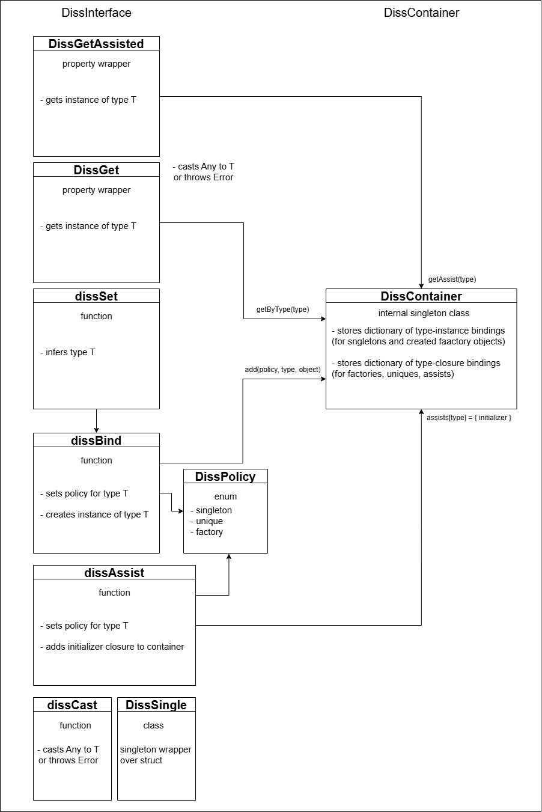

# DISS (**D**ependency **I**njection **S**wift **S**imple)
## Библиотека для внедрения зависимотей на Swift
### Интерфейс
Обёртка свойств `DissGet` .
 
Функция `DissSetSingleton { initializer() }` - Добавляет в DI контейнер объект типа T, при попытке получить объект данного типа будет возвращаться один и тот же объект (доступно только для классов).

Функция `DissSetBind(type) { initializer() }` - Добавляет в DI контейнер пару 'тип - объект', при попытке получить объект типа T будет возвращаться привязанный объект (доступно для классов и структур).
### Архитектура
